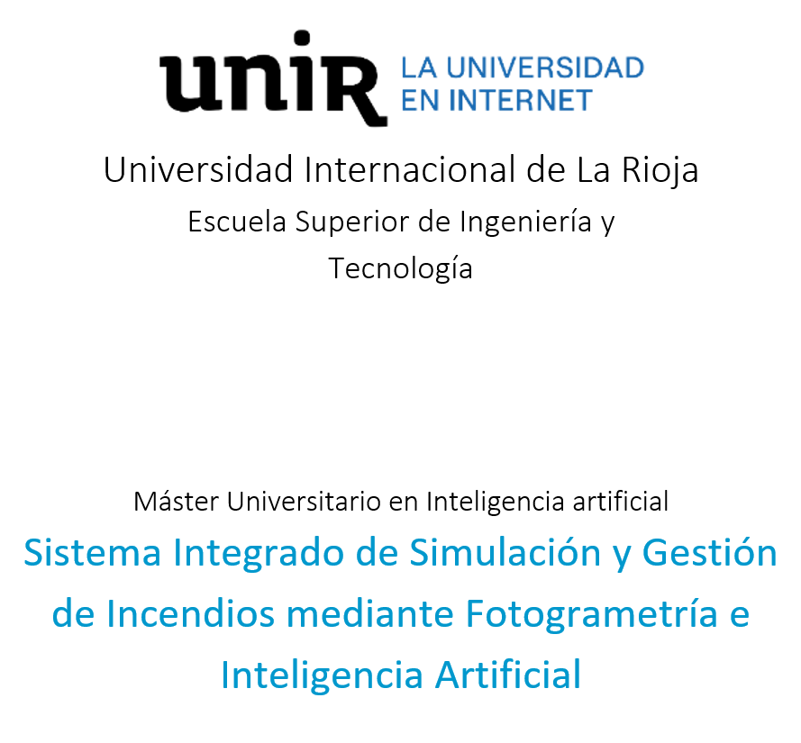
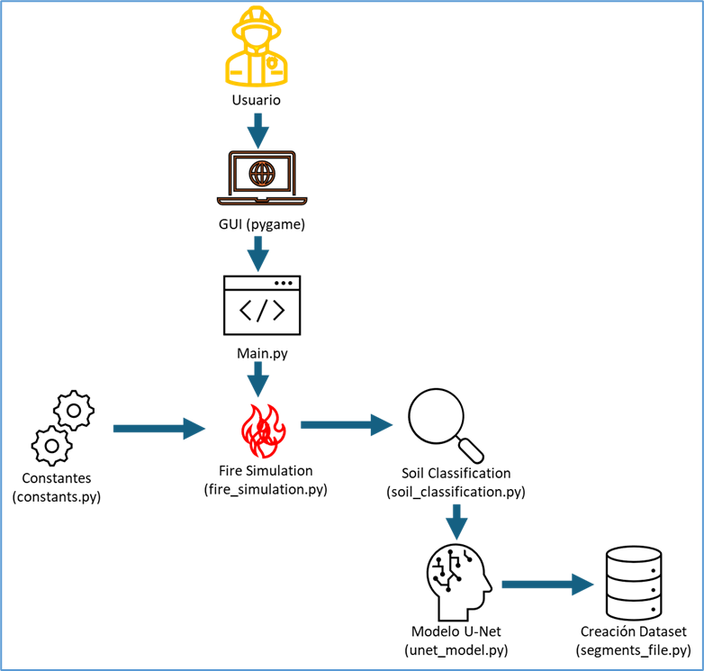
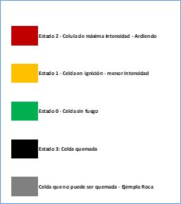
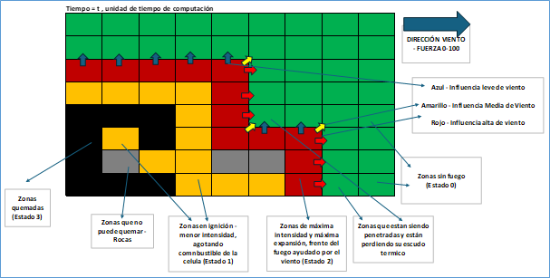
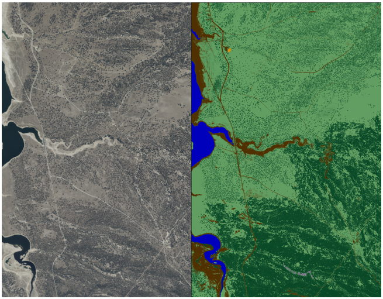
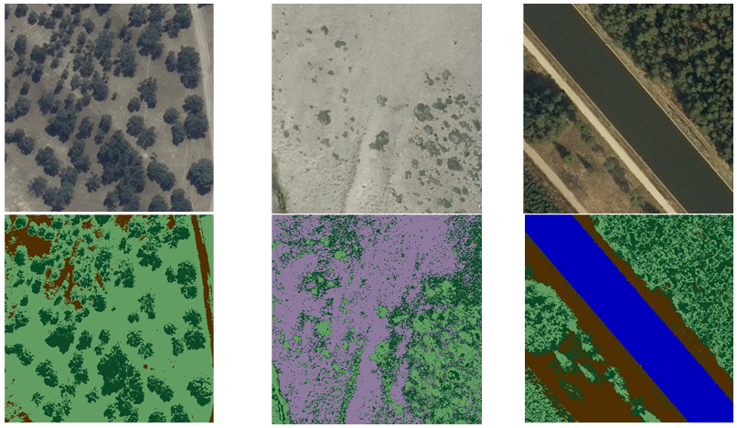
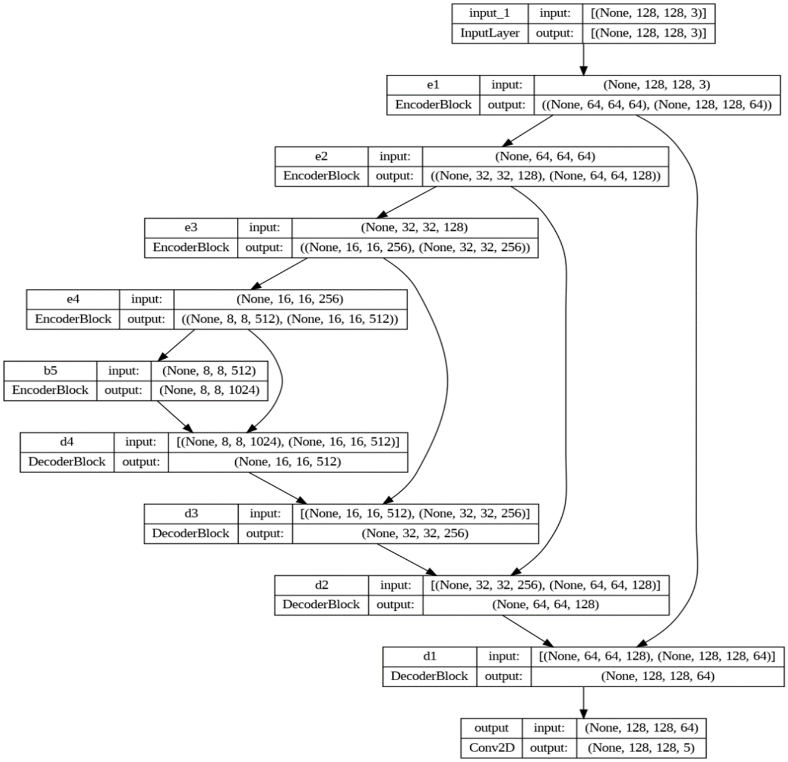
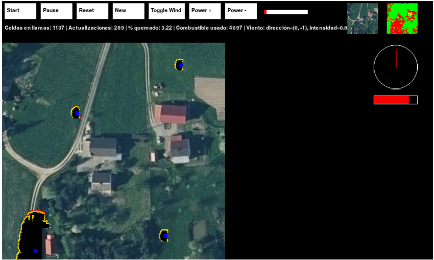
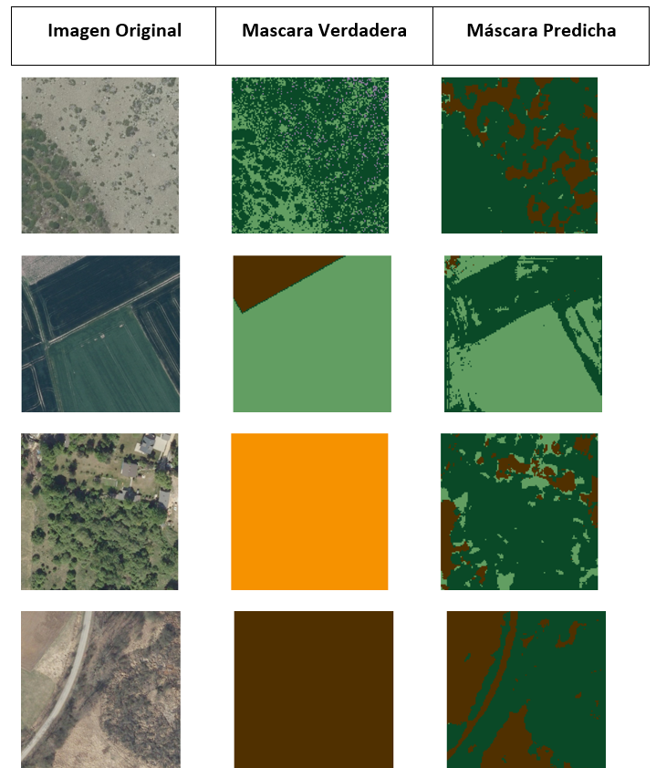
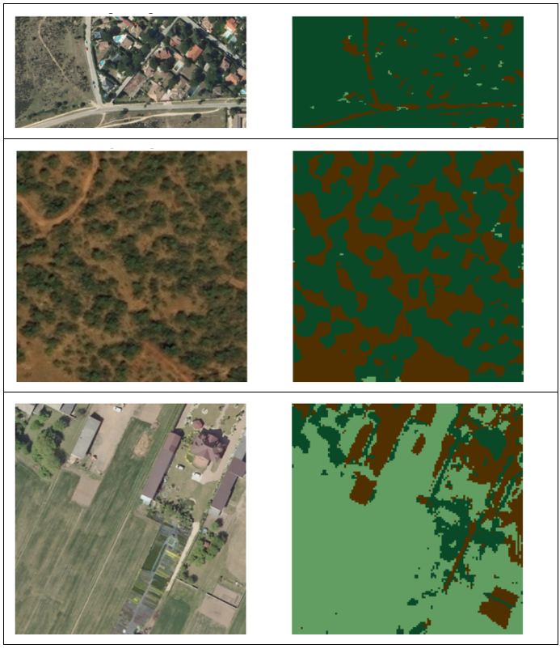

# Sistema Integrado de Simulación y Gestión de Incendios mediante Fotogrametría e Inteligencia Artificial

## Insignias

## Índice

- [Descripción del proyecto](#descripción-del-proyecto)
- [Estado del proyecto](#estado-del-proyecto)
- [Características de la aplicación y demostración](#características-de-la-aplicación-y-demostración)
- [Tecnologías utilizadas](#tecnologías-utilizadas)
- [Descripción de los ficheros](#descripción-de-los-ficheros)
- [Propagación del autómata](#propagación-del-autómata)
- [Datos utilizados](#datos-utilizados)
- [Arquitectura U-Net](#arquitectura-u-net)
- [Resultados](#resultados)
- [GIFs de la herramienta](#gifs-de-la-herramienta)
- [Licencia](#licencia)
- [Conclusión](#conclusión)

## Descripción del proyecto

Los incendios forestales son un tema real que afecta a todos, no solo a las personas, sino también a los animales, plantas, ecosistemas e incluso a la climatología global. Con el cambio climático, la contaminación, accidentes, incluso eventos naturales y provocados por el hombre; la probabilidad de que se inicie un incendio es constante.

Por ello, el objetivo principal de esta investigación es proporcionar una herramienta para la planificación y el entrenamiento ante emergencias de incendios forestales con la idea de crear un servicio que impacte de manera positiva en la sociedad y ayuda a combatir los incendios.

El desarrollo del proyecto se ha basado en el estudio de las investigaciones más recientes sobre incendios, simulaciones y la aplicación de tecnología de inteligencia artificial en simulaciones. Por ello, la aplicación desarrollada emplea un modelo de segmentación U-Net para generar mapas de riesgo del terreno y utiliza autómatas celulares para simular la propagación del fuego bajo diversas condiciones.

Para conseguir el objetivo de que el modelo U-Net sea fiable, se ha creado un conjunto de datos específico de áreas no urbanas con 7 clases y un total de 8600 imágenes, que permite segmentar semánticamente las imágenes aéreas que capture un dron y obtener un mapa de riesgo con preciso. El modelo alcanzó métricas de rendimiento significativas, incluyendo un coeficiente de Dice de 0.7697 y una precisión de 0.7697 en los datos de entrenamiento, con métricas de validación de 0.6952 para ambos.

La integración de técnicas avanzadas de aprendizaje profundo con simulación interactiva ofrece una plataforma adecuada para el entrenamiento y la planificación de emergencias. Este proyecto establece una sólida base para utilizar tecnologías avanzadas en la gestión de incendios forestales y presenta un potencial significativo para aplicaciones del mundo real en la preparación y respuesta ante emergencias.

Es un proyecto de Fin de Estudios del Master en Inteligencia Artificial de la universidad UNIR. Mi nombre es Antonio Adam Bejar Gladkowski, mi correo electrónico es antonio.adam.bejar@hotmail.com.

## Estado del proyecto

El proyecto, como parte de un Master, se ha depositado en la universidad y está terminado su desarrollo.

## Características de la aplicación y demostración

- Simulación de propagación de fuego basada en autómatas celulares.
- Control de dirección e intensidad del viento en tiempo real.
- Diferentes tipos de suelo con distintos niveles de riesgo de incendio.
- Visualización gráfica interactiva utilizando Pygame.

## Tecnologías utilizadas
- Python 3.10: Lenguaje de programación principal.
- PyCharm: Entorno de desarrollo integrado (IDE) para escribir y depurar el código.
- TensorFlow y Keras: Librerías para construir y entrenar el modelo U-Net utilizado en el análisis de riesgo.
- OpenCV: Librería para el procesamiento de imágenes.
- Pygame: Librería para crear interfaces gráficas y simulaciones interactivas.
- NumPy: Librería para operaciones numéricas y manejo de matrices.

## Descripción de los ficheros
- fire_simulation.py: Define y gestiona la simulación de incendios forestales mediante autómatas celulares, determinando la propagación del fuego en función del tipo de terreno y las condiciones ambientales. Incluye funciones para inicializar el estado del fuego y actualizarlo en cada iteración de la simulación. Utiliza datos de clasificación de terreno proporcionados por soil_classification.py para ajustar la simulación.
- gui.py: Contiene las funciones para dibujar la interfaz gráfica de usuario utilizando Pygame, incluyendo la visualización del estado del fuego, los controles de viento, y la selección de imágenes clasificadas. Integra elementos de la interfaz gráfica y maneja eventos de usuario para interactuar con la simulación. Interactúa con main.py para actualizar y mostrar la simulación.
constants.py: Este archivo define constantes globales utilizadas en todo el sistema, como dimensiones de la ventana, colores, y parámetros de la simulación. Actúa como un repositorio central de configuración para asegurar la consistencia en todo el proyecto.
- soil_classification.py: Implementa funciones para preprocesar imágenes, clasificar el terreno utilizando un modelo de segmentación U-Net, y generar mapas de riesgo basados en las clases de terreno identificadas.
- unet_model.py: Contiene la definición de la arquitectura del modelo U-Net, incluyendo las clases para los bloques de codificación y decodificación y la función para construir el modelo completo. Utiliza TensorFlow/Keras para implementar y configurar la red neuronal para la segmentación de imágenes. El entrenamiento del modelo U-Net se produce en Google Colab Pro, guardando los checkpoints para recuperar el mejor de los modelos.
- main.py: Inicializa y coordina todos los componentes del sistema, incluyendo la carga del modelo U-Net, la segmentación y clasificación del terreno, y la configuración de la interfaz gráfica. Contiene el bucle principal del simulador que actualiza y muestra la simulación de incendios forestales en tiempo real.
- segments_file.py: Genera las miniaturas y sus máscaras correspondientes a partir de las imágenes GeoTIFF. El usuario puede modificar el tamaño de las imágenes resultantes, por defecto es 512*512. Toda la división de las imágenes en miniaturas es registrada en un fichero CSV que permite referenciar cada imagen con su máscara y con la imagen original.

  

## Propagación del autómata
- Propagación por viento: El fuego se propaga de una celda a otra adyacente si hay suficiente combustible y el escudo de la celda destino es menor que la intensidad del fuego de la celda origen. La dirección del viento influye directamente en la probabilidad de propagación hacia dicha dirección. El fuego se propaga más fácilmente en la dirección del viento y más difícilmente en contra del viento, llegando a agotar el fuego de la cola en algunos casos.
- Propagación por tipo de terreno: Las celdas con diferentes tipos de terreno tienen diferentes cantidades de combustible y niveles de resistencia al fuego. Por ejemplo, las celdas de riesgo bajo tienen un escudo alto y menos combustible, mientras que las celdas de riesgo alto tienen más combustible y un escudo bajo.
- Disminución del combustible: A medida que el fuego arde en una celda, el combustible disponible se consume en cada unidad de tiempo, llegando a agotarse y transicionando la celda al estado quemado.

Tipos de celda definidas para el autómata:

  

Reglas de movimiento para el autómata:  

  

## Datos utilizados

Debido a la necesidad de tener datos de calidad específicos para el mapa de riesgo, y con la amplia variabilidad que presentan las imágenes aéreas de la Sierra de Madrid, se ha optado por la creación de un dataset propio partiendo de las imágenes de drones del proyecto PNOA del Instituto Geográfico Nacional de España. Para ello, se han seleccionado un total de siete imágenes aéreas en formato GeoTIFF, siendo el utilizado por todas las comunidades de ciencias geoespaciales y terrestres para compartir datos geográficos. Cada una de estas imágenes tiene 340 megapíxeles y una resolución de 96 dpi con una profundidad de color de 24 bits, lo que dificulta su procesamiento y edición sin el uso de herramientas de visualización y tratamiento de imágenes. Por ello, se ha utilizado la herramienta GIMP en su versión 2.10, la cual permite la edición de imágenes mediante renderizado por GPU.

 

Para la creación del dataset es necesario que cada imagen disponga de una máscara segmentada, por lo que es necesario la creación de los segmentos, donde cada color corresponde a un segmento semántico concreto, habiéndose seleccionado tras el estudio de las imágenes un total de 7 segmentos. Tras la creación de los segmentos se ha procedido a la creación manual de las máscaras de cada imagen de 340 megapíxeles, dando lugar a una capa de igual tamaño que la original, con la superficie del terreno clasificada.

 
Una vez editadas las 7 imágenes aéreas y sus correspondientes máscaras, se ha procedido a la creación de miniaturas para el dataset. Cada miniatura creada tiene un tamaño de 512x512, resultando en un total de 8600 miniaturas de imágenes y 8600 máscaras, con un peso del dataset completo de 3.86GB. Para ello se ha desarrollado en Python un creador de miniaturas que lee las imágenes GeoTIFF, recorre desde arriba a la izquierda hasta abajo a la derecha cada una de las imágenes de las máscaras y genera las correspondientes miniaturas. Es importante que cada miniatura de la imagen tenga exactamente la misma miniatura de su máscara en términos de coordenadas sobre la imagen, de lo contrario, la máscara no representaría la realidad y provocaría que la red entrenada no tuviera los resultados previstos. Por otro lado, es importante que tanto el nombre de la miniatura de la imagen como el nombre de la miniatura de la máscara estén referenciados, por lo que en paralelo se ha desarrollado un dataset en CSV que genera esta relación, el cual contiene 3 columnas, una referenciando la miniatura de la imagen, otra columna referenciando la miniatura de la máscara y una tercera con la referencia de la imagen original.

 

## Arquitectura U-Net

Para la segmentación multiclase de las imágenes aéreas se ha optado por una red neuronal con arquitectura U-Net. Este tipo de arquitectura fue utilizada por primera vez por Olaf Ronneberger, Philipp Fischer, y Thomas Brox, los cuales propusieron la nueva arquitectura de red convolucional U-Net para la segmentación de imágenes médicas en el año 2015. Esta arquitectura es una versión mejorada y modificada de una red FCN (Full Convolutional Network). La arquitectura U-Net consiste en una ruta de contracción conocida como codificador y una ruta de expansión que se conoce como decodificador, que le dan a esta arquitectura una forma de U.

El codificador es una pila tradicional de capas convolucionales y de agrupación máxima para codificar la imagen de entrada en representación de sus características en múltiples escalas diferentes. El codificador capta el contexto de la imagen y define que se presenta en la imagen. Cada bloque del codificador consiste en dos capas convolucionales seguidas de una capa de agrupación máxima (MaxPooling). Este bloque reduce las dimensiones de la imagen mientras aumenta la cantidad de características.

El decodificador consta de muestreo ascendente y concatenación seguido de operaciones de convolución. El propósito del muestreo ascendente es expandir las dimensiones de las características para restaurar el mapa de características condensado al tamaño original de la imagen de entrada. El propósito de la concatenación es combinar los mapas de características de la red del codificador con los mapas de características muestreados en la red del decodificador para recuperar la información detallada de la imagen que se pierde durante el proceso de muestreo. Las convoluciones regulares posteriores ayudan a aprender la localización precisa, es decir el dónde, de los objetos en la imagen. Cada bloque del decodificador consiste en una capa de convolución transpuesta (Conv2DTranspose) para aumentar las dimensiones de la imagen, seguido de la concatenación con la salida correspondiente del codificador y dos capas convolucionales para refinar las características. Para adaptar las imágenes al tamaño requerido por el modelo U-Net, se procesan las miniaturas de 512x512 píxeles para reducirlas a 128x128 píxeles. Este preprocesamiento asegura que todas las imágenes tengan el tamaño adecuado para ser utilizadas en el modelo.

 

En total se han utilizado 50 épocas para el entrenamiento, con el optimizador ‘adam’, que ajusta los pesos del modelo para minimizar la pérdida de Dice, y como métrica se ha utilizado la precisión y el Coeficiente Dice, siendo este una métrica para evaluar la similitud entre las predicciones del modelo y las etiquetas verdaderas. Es especialmente útil en tareas de segmentación porque considera tanto la precisión como el recall, proporcionando una medida equilibrada de rendimiento. La época 50, es la que mejores resultados ha arrojado, lo cual indica que de seguir entrenando el modelo probablemente se mejorarían los resultados. El Coeficiente Dice tiene un valor de 0.7697, la precisión de 0.7697 y la pérdida Loss de 0.2303. La pérdida es la más baja registrada, mientras que la precisión y el coeficiente de Dice son las más altas. Con este valor de Coeficiente Dice podemos afirmar que la segmentación es muy precisa y esto sugiere que el modelo ha aprendido de manera efectiva las características relevantes de las imágenes.

El entrenamiento ha durado en torno a las 5 horas, hacia las últimas épocas, el modelo muestra estabilidad en la mejora de las métricas, lo que sugiere que ha alcanzado un buen equilibrio entre la precisión de entrenamiento y la generalización.

El modelo entrenado que se utiliza para el simulador es el de la época 50, el cual ha proporcionado los mejores resultados en términos de precisión y coeficiente de Dice, haciendo de esta versión la más adecuada para tareas de segmentación en el conjunto de datos específico utilizado, además tras las pruebas sobre el conjunto de datos de validación se observa que es robusto, incluso en pruebas realizadas sobre imágenes no incluidas en el entrenamiento el resultado visual es muy preciso.

## Herramienta de Software

Funciones:
- El software viene precargado con 40 imágenes aéreas de diferentes areas de la Sierra de Madrid.
- Permite utilizar imágenes propias de diferentes resoluciones.
- Se puede controlar la intensidad del fuego.
- Control sobre el viento mediante teclado, tanto la dirección como la intensidad.
- Selección de varios focos de incendio.
- Reset.
- Pausa.
  
 

 
## Resultados

Resultados con las imágenes de validación:

 

 

Resultados con imágenes desconocidas:

 

## GIFs de la herramienta

Aquí se pueden añadir GIFs que muestren el funcionamiento de la herramienta en acción.

